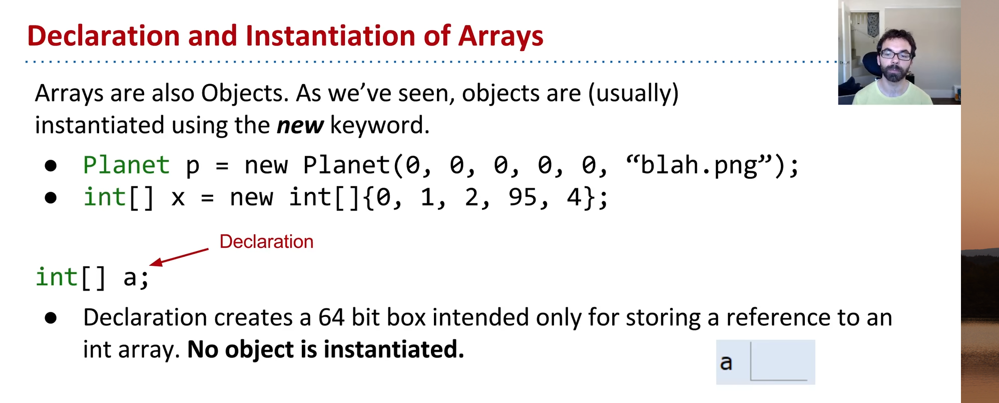
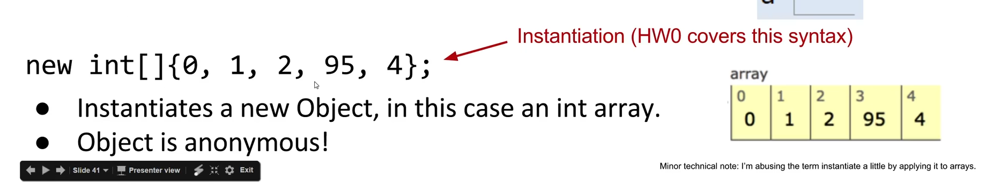

```java
new int[]{0, 1, 2, 95, 4};
```

- This instantiates a new object i.e. creates 5 boxes each of size 32.



## List vs Array
- A list can grow arbitrarily large. A java array has a fixed size.
